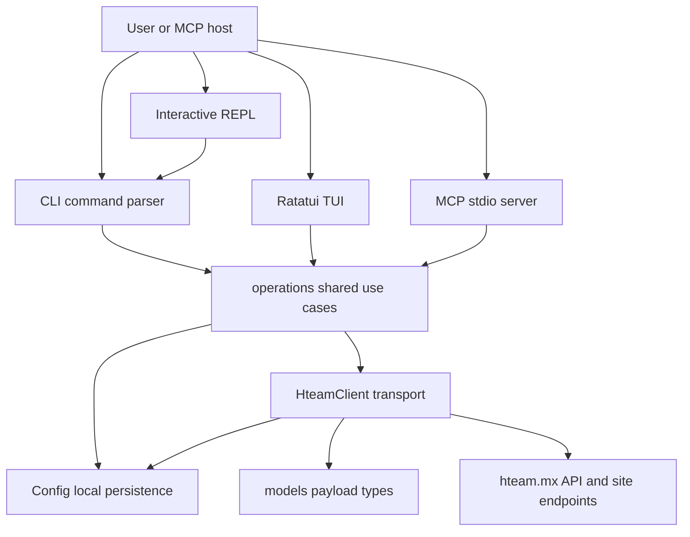

# System overview

The `hteam` Tokio binary has one application core shared by several terminal-facing delivery mechanisms. `main` starts the CLI dispatcher; its `interactive`, `tui`, and `mcp` commands select the REPL, visual terminal UI, and stdio MCP server respectively. These are alternative **presentation adapters**, not separate implementations of Hteam behavior. [Quickstart](/openwiki/quickstart.md) describes the user-facing commands; [terminal experiences](/openwiki/operations/terminal-experiences.md) describes the individual surfaces.

## Ownership map

| Layer | Owns | Must not own |
| --- | --- | --- |
| CLI, REPL, TUI, MCP | Input parsing, protocol/UI event handling, rendering, and translating errors/results into their native output | Business decisions or direct HTTP calls to Hteam |
| `operations` | Shared use cases and cross-surface rules, expressed in domain values | `println!`, Ratatui state/widgets, MCP result formatting, or transport implementation |
| `client::HteamClient` | All Hteam request construction, authentication headers/cookies, response status handling, endpoint quirks, and in-memory client cache | Terminal presentation or feature-specific UI policy |
| `config::Config` | Loading and saving local user state | Remote API transport |
| `models` | Serde representations and normalization of Hteam payload shapes into useful domain data | Network requests and workflow/presentation policy |

This diagram shows the intended request path: adapters present inputs and results, shared operations coordinate use cases, and only `HteamClient` crosses the remote boundary.

The REPL currently routes its parsed shortcuts through CLI handlers, while CLI, TUI, and MCP invoke shared operations for application actions. `HteamClient` is the only component that sends requests to `hteam.mx`; it turns HTTP responses into types from `models`.

## Entrypoints and session construction

`#[tokio::main]` calls `cli::run()`. Clap dispatches conventional commands and the three long-lived alternatives: `Interactive`, `Tui`, and `Mcp`. The MCP path opens a session once, then serves tools over stdio; the TUI opens a session, resolves a board, loads state, enters the alternate terminal screen, and runs its event loop.

For authenticated work, `operations::Session::open()` is the common composition point: it loads `Config`, clones it into `HteamClient::with_auth`, and returns both. Authentication requires both `session_id` and `csrf_token`; the client rejects an unauthenticated configuration before a request is made. Login is an adapter-level setup flow: it collects or accepts cookie values, optionally records the selected board, tests them through `HteamClient`, and saves only after successful verification.

**Change rule:** use `Session::open()` for a normal authenticated adapter entrypoint. Do not reimplement config loading, authentication checks, or client construction independently unless the use case has a concrete lifecycle reason.

## The operations contract

`operations` is the seam for behavior that multiple delivery surfaces should share. Its modules cover boards, cards, check-in, comments, daily work, projects, reminders, users, and working-on-it. Functions accept `&HteamClient`, plus `&mut Config` where a preference must be persisted, and return plain domain data or `Result<()>`. The MCP server demonstrates the intended boundary: tool handlers deserialize tool parameters, call `operations`, and serialize their result with MCP-specific `CallToolResult` formatting.

Operations may establish meaningful defaults and multi-step workflows. For example, `operations::cards::move_card` defaults an omitted source list to Open (`1`), and `update_card` first retrieves detail so that the client can submit a full edit form while preserving unspecified fields. This policy belongs in operations because every surface needs the same outcome. A Mockito-backed test verifies both the default move payload and the fetch-then-post update sequence.

Board choice is another shared invariant. `resolve_board_number` uses this precedence:

1. an explicit adapter override;
2. `Config.auth.board_number`;
3. the last board recorded in `~/.last_ticket`.

The TUI uses that resolver before it begins, and focused unit tests cover explicit-over-default and configured-default behavior. Board switching is an operation that updates the configured board, writes the last-ticket file, upserts board display metadata, and persists `config.toml`. Do not create feature-local board fallback chains; see [session configuration](/openwiki/concepts/session-configuration.md).

## Transport and remote-state boundary

`HteamClient` owns the concrete `reqwest` client, base URLs, a mutex-protected in-memory `Config`, and all Hteam endpoint interaction. It builds a consistent request identity: referer, manually constructed `sessionid`/`csrftoken` cookie header, `X-CSRFToken`, optional bearer token, AJAX header, and accept header. Its 30-second client timeout and contextual errors make transport failures observable at the adapter boundary.

The client also contains remote protocol accommodations that must not leak upward:

- It selects the configured or last-used board when an endpoint receives no board argument.
- It caches `board_id` and invalidates it when the board number changes, preventing create/move actions from using an ID from the previous board.
- It discovers and persists `user_id` when required, first from working-on-it data and then from the latest work-shift record.
- It accepts working-on-it and reminders responses that may be empty, `null`, or multiple supported JSON shapes.
- Comment posting fetches the task page first to extract the form tokens required by the site endpoint, then sends the encoded form.

These are transport/protocol responsibilities even when they involve several requests. [Hteam API integration](/openwiki/integrations/hteam-api.md) details the external boundary.

**Non-negotiable boundary:** never add a `reqwest` call, Hteam URL, request header/cookie construction, or API-response workaround to `cli/`, `tui/`, `mcp/`, or the REPL. Add or extend an `HteamClient` method, expose the reusable behavior from `operations` where appropriate, then let each adapter present the returned result. Likewise, do not put a business decision in a delivery adapter merely because it is convenient for one interface.

## Local persistence lifecycle

`Config` is the local state owner. It reads and writes TOML at the platform configuration directory under `hteam/config.toml`; missing configuration produces a default value, while read, parse, directory-creation, serialization, and write failures are propagated with context. Persisted state includes authentication material, default board and cached IDs, named-board metadata, variables, TUI preferences, and working-hour settings. The separate `~/.last_ticket` file stores the fallback board used by session resolution.

A client receives a cloned configuration and protects its own in-memory copy with `Arc<Mutex<Config>>`. Therefore, a caller that changes a separate `Session.config` must deliberately persist it through the operation that owns that transition. Conversely, client-side caches such as discovered `user_id` can save themselves. Treat this as an ownership/lifecycle distinction rather than assuming all copies update automatically.

## Models as an anti-corruption boundary

`models` prevents external JSON details from becoming application-wide assumptions. It maps API field names such as card `title`, `subtitle`, `labels_list`, and list `total_board_cards` to stable Rust fields. It also deliberately normalizes irregular payloads: card-detail labels tolerate an array of label objects as well as scalar/string forms by yielding an empty label set for unsupported forms; working-on-it responses become `WorkingOnStatus`; project milestones deserialize from tuple-shaped API entries and normalize their progress representation for display.

Keep this boundary honest: add serde aliases, custom deserialization, or conversion types here (or immediately alongside transport parsing) when Hteam payload variance is discovered. Do not make CLI/TUI/MCP consumers parse `serde_json::Value` or compensate independently.

## Adapter-specific state and failures

Adapters are free to own ephemeral presentation state. The TUI owns selection, dialog state, visible-list filtering, redraw timing, and terminal cleanup. It performs an optimistic card move for responsiveness, but reverts its local card placement when the shared operation fails; the remote mutation still flows through `operations` and `HteamClient`. Its hidden-list preference is persisted through `Config` after the UI decision is made.

MCP owns schema/parameter decoding and converts `anyhow` failures to MCP internal errors; it serializes successful domain values as JSON text content. The CLI owns Clap parsing and chooses JSON, tables, or messages. The REPL owns readline history in `~/.hteam_history` and command shortcuts, then delegates to CLI handlers. No adapter should let rendering, a partial refresh failure, or an interface protocol change redefine core business rules.

## Safe extension checklist

1. Define the operation in `operations` when the behavior, default, validation, or sequence is reusable; return models or plain values.
2. Put every new Hteam request, auth/header requirement, response status check, and response-shape accommodation in `HteamClient`.
3. Extend `models` for external payload mapping and normalization.
4. Put durable user preference or credential changes in `Config` and make persistence explicit.
5. Add thin adapter glue for CLI output, TUI interaction, REPL routing, or MCP schemas—not another implementation of the use case.
6. Add focused tests at the ownership seam: operations tests use `HteamClient::new_for_test` with Mockito to assert request paths/payloads and shared defaults; pure configuration or resolver rules use ordinary unit tests.

For MCP-specific tool availability and stdio operation, see [MCP server](/openwiki/integrations/mcp-server.md). For board/card terminology, see [cards and board state](/openwiki/concepts/cards-and-board-state.md).