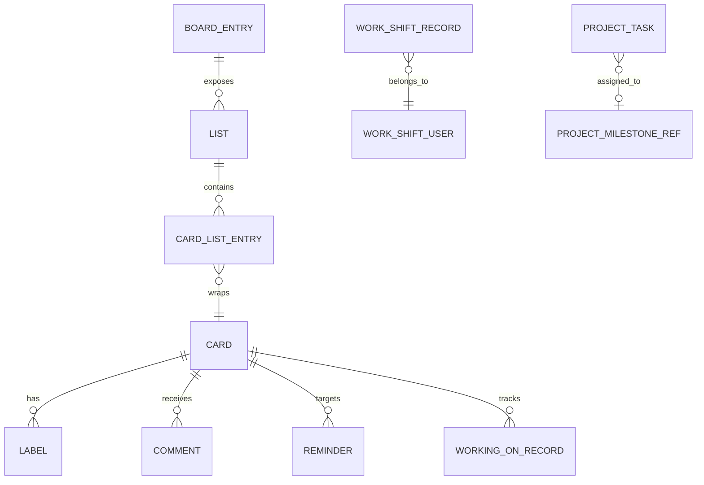

The domain layer is deliberately presentation-free: `operations` shares plain domain data and mutations among the CLI, TUI, and MCP server, while `HteamClient` owns the authenticated Hteam HTTP calls. The remote API is the system of record; local configuration retains the active-board selection, cached API board ID, known boards/projects, and user ID rather than board contents.

## Identifier guide — do not interchange these values

Several numeric fields refer to different namespaces despite similar names.

| Identifier | Meaning and where it is used |
| --- | --- |
| **Board number** | The user-facing operation/process number, stored as `auth.board_number`. List and card-list routes include it in their URL, task edit and comment page routes include it as the process ID, and `move_card` sends it in a field named `board_id`. It is selected explicitly, otherwise resolved from configuration and then `~/.last_ticket`. |
| **API `board_id`** | A distinct board identifier carried by a `CardListEntry`. It is required by the board-card creation and card-label routes. `get_board_id` caches it only after deriving it from a card-list response for the active board. |
| **List ID** | `List.id`, used in a board-scoped list/cards route and as the source/destination of a move. List `1` is treated by this client as Open and list `2` as Closed; those are client conventions for the convenience calls, not a modeled board-wide enum. |
| **Card ID** | `Card.id` / `CardDetail.id`, the task identity used for detail, comments, updating, reminders, and starting work. It is **not** the list-entry ID (`CardListEntry.id`). |
| **Working-on-it record ID** | `WorkingOnStatus.id`, the identity of a tracking record. It is different from `WorkingOnStatus.card_id`, which comes from remote `object_id`. Stopping work requires this record ID, not a card ID. |
| **Project ID / milestone ID** | Project routes take a project ID; a project task may include an optional milestone reference with its own ID. A project task's `number` is exposed as a task number but this client does not establish a link to `Card.id`. |
| **Shift ID / user ID / label ID / reminder ID / comment ID** | Independent IDs returned by their respective endpoint payloads. A check-in may return a shift ID; the active-shift resume embeds a user ID. |

### Board ID resolution and selection lifecycle

The active **board number** is a local preference. Switching a board persists the number to `config.toml` and `~/.last_ticket`, updates its display-name/MRU metadata, and returns the resolved name. Changing the number through the client clears cached `auth.board_id`, because an API board ID belongs to the prior board.

When an API `board_id` is needed and no cache exists, the client lists Open (list `1`) and takes the first card-list entry's `board_id`. Since Open may be empty, it then tries each listed nonempty list. An entirely cardless board cannot supply this value through the implemented discovery path and yields `No se pudo obtener board_id`.

This diagram shows only response-model and endpoint-supported relationships. In particular, a `CardListEntry` supplies the API `board_id` while `Card` supplies the card ID, and the tracking/reminder links use a card `object_id`.

## Board and card representations

`List` contains an ID, name, and optional `card_count` deserialized from `total_board_cards`. `CardListResponse` describes a list response: its `cardlist_list` holds `CardListEntry` wrappers with list-entry identity, API `board_id`, closure/type/time/position metadata, and a nested card. The list-card operation deliberately returns `(Vec<Card>, Option<u64>)`, dropping wrapper metadata except the first available API `board_id`.

The compact `Card` uses API fields `title`, `subtitle`, and `labels_list` as Rust `name`, optional `description`, and labels. `CardDetail` is the edit/read base and additionally retains status, its optional current list, timestamps, estimate, start date, dependency, responsible, and priority. Detail label decoding is defensive: it accepts an array and retains only valid label objects; a scalar or otherwise incompatible value becomes an empty label list.

A `Label` has `id`, `name`, and `color`. The client reads a card's available labels with the API `board_id`; it does not expose an operation that changes the label collection directly.

### Creating and moving cards

Card creation first resolves three prerequisites: API `board_id`, active board number, and user ID. It posts a JSON body where `process` is the board number, `complement` is the user ID, and `labels` is either empty or contains the supplied `list_id`; despite that parameter name, this is the implemented placement input. Successful creation may return an empty body or an unusable card. In that case, the client searches the requested list by exact card name; if it still cannot find the card (or no list was supplied), it returns a placeholder `Card` with `id: 0`. Consumers must not treat that fallback as a confirmed remote card identity.

Moving posts the card ID, source/destination list IDs, card type `0`, and the selected board number under `board_id`. The operation wrapper defaults an omitted source to list `1` (Open), so callers should provide `from_list` whenever the card might be elsewhere. HTTP failures are returned with status and response text.

## Safe card edits are read-modify-write

The Hteam task edit endpoint is form-shaped rather than a partial PATCH. `operations::cards::update_card` therefore fetches `CardDetail` first and passes it as an `UpdateCardPatch` base. The client always submits process ID, ID, name, description, estimate, start date, dependency, responsible, and priority:

- supplied name, description, priority, and responsible override the fetched values;
- all other values are preserved from the detail response, with absent optional string/value fields encoded as empty;
- absent priority defaults to `"3"` only when the detail lacks a priority.

`update_description` follows the same pattern after resolving the active board number. This pre-read is a mutation precondition: bypassing it risks clearing editable fields the caller did not intend to change. The request needs the configured CSRF token and is rejected on HTTP status 400 or above.

## Comments, mentions, and reminders

A comment belongs to a card and captures author name, text, submission date, nesting (`level` and optional `parent_id`), removal status, and optional permalink. Reading comments returns the remote `results` array.

Posting is not a simple API JSON operation. Before posting, the client fetches the board-number-specific card page and extracts the current `timestamp`, `security_hash`, and CSRF form fields; missing any of them fails the operation. It submits those fields plus `content_type=processes.task`, the card ID as `object_pk`, text, `reply_to=0`, and a locally formatted date. `follow` is omitted by default and only sent as `follow=on` when true. Dates supplied to the operation must be `%Y-%m-%d %H:%M`; blank or omitted values default to local current time, while malformed values fail before network I/O.

Mention autocomplete returns `UserSuggestion` entries. Their IDs are strings (not numeric user IDs); `selected_text` is the username suitable for insertion and `text` is the preformatted display label. An unfinished whitespace-delimited `@token`, including bare `@`, is eligible for lookup.

A `Reminder` independently records its own ID, a card `object_id`, optional type/date, and optional card-like `content_object`. Creating a card reminder posts fixed `type: 1` and `card_type: 0` with the card ID. Reading accepts either the documented `{ "reminders": [...] }` shape or a bare array; an empty/null response is empty, and any other nonempty unparseable response is also treated as empty.

## Working-on-it and shifts

A working-on-it response represents a per-user tracking record with its own ID, `user`, card `object_id`, `content_type`, timestamps, and a `content_object` title/URL. It is converted to `WorkingOnStatus` as:

- `id`: the tracking-record ID;
- `card_id`: `object_id` — the card ID;
- `card_name`: the content title; and
- `started_at`: `created_at`.

The working list endpoint may return null/empty, an array, or one object; the client normalizes the first two data shapes to a vector and errors for another nonempty shape. Start work posts the **card ID** with fixed `content_type=99`. Stop work instead sends a PUT to a route keyed by the **working-on-it record ID**, again using content type `99` and state `4`. To stop a selected card safely, first list working records and map its `card_id` to the record `id` via `working_id_for`.

A check-in returns optional check-in/check-out strings and an optional shift ID. Shift resume returns an optional last `WorkShiftRecord`, which includes a shift record ID, embedded user, and check-in/check-out values. User-ID discovery first attempts working-on-it responses, then falls back to the last shift's user; if neither is available it fails. A discovered user ID is persisted because it is user-scoped rather than session-scoped.

## Projects and local project history

Project reads are separate from boards and cards. Milestones deserialize from positional `(name, progress, url)` tuples. A project-task response has a total `count` and task results with number, name, optional milestone reference, numeric progress, closed flag, and optional responsible user. The display helper treats progress at or below `1.0` as a fraction and larger values as percent, then caps it at 100; that conversion is presentation behavior, not stored state.

Selecting a project for TUI use calls `remember_project`, which deduplicates its ID, puts it first in `[tui] known_projects`, and saves configuration. This is a local MRU convenience only; it does not mutate remote project membership.

## Entry points, errors, and regression focus

All delivery surfaces should use `operations::{boards,cards,comments,projects,reminders,working,checkin}` rather than reproduce HTTP workflow. The MCP server follows this boundary, exposing card reads/mutations, comments, reminders, working status, project data, and check-in as tools; it maps any operation error to an MCP internal error.

Mutations and reads consistently fail on non-success HTTP status (with response text when available), except for the explicitly tolerant empty/null variants documented above. The focused mock tests cover the highest-risk contracts: card-list extraction of API `board_id`, move defaulting to Open, fetch-before-edit field submission, comment date validation, wrapped reminder responses and creation body, start/stop working's distinct IDs, project payload shapes, and check-in/resume payloads.

See also: [session configuration](/openwiki/concepts/session-configuration.md), [Hteam API integration](/openwiki/integrations/hteam-api.md), [MCP server](/openwiki/integrations/mcp-server.md), [terminal experiences](/openwiki/operations/terminal-experiences.md), and [card mutations and comments](/openwiki/workflows/card-mutations-and-comments.md).
