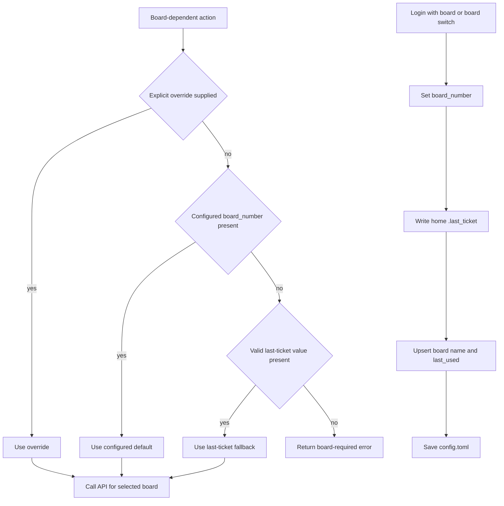

# Authentication, sessions, and persisted preferences

Hteam keeps user-local state in two places: the platform configuration directory and a few home-directory files. `Config` is the durable model; `HteamClient` owns a cloned, mutex-protected copy for request-time state. This distinction is important: changing the client's cached configuration does **not** write `config.toml` unless a caller explicitly saves a separately loaded `Config` (with the deliberate exception of the user-ID cache described below).

## Local state and security boundary

`Config::config_dir()` resolves the OS configuration directory and appends `hteam`; `config.toml` lives there. On common Linux installations this is `~/.config/hteam/config.toml`, but consumers should use the resolver rather than hard-code that platform-specific expansion. A missing configuration file loads as a default empty configuration; malformed TOML or filesystem failures are returned as errors. Saving creates the configuration directory and rewrites the whole pretty-serialized configuration file.

`config.toml` is **credential-bearing**: its `[auth]` data can contain `session_id`, `csrf_token`, `access_token`, and `refresh_token`. Treat it as a secret, do not commit, publish, or casually copy it, and be aware that `config show` in the interactive shell loads and displays this same configuration. The implementation does not set restrictive file permissions or encrypt its contents, so deployment and workstation permissions are the operator's protection boundary.

The independent `~/.last_ticket` file contains only a board number, while `~/.hteam_history` stores interactive REPL command history. The TUI also appends status messages best-effort to `tui.log` in the Hteam configuration directory. History and logs are not credential stores by design, but can contain user-entered operational details; handle them as local user data.

## `config.toml` model

The persisted `Config` schema is:

| Section / field | Meaning and lifecycle |
| --- | --- |
| `[auth] session_id`, `csrf_token` | Cookie-authentication material collected by `hteam login`; both must be present for the configuration to count as authenticated. |
| `[auth] access_token`, `refresh_token` | Optional bearer-token fields. The client sends `access_token` when present; no refresh flow is implemented here. |
| `[auth] board_number` | Durable configured default board. |
| `[auth] board_id` | Remote/internal board identifier cache. It is read and filled in the client process, but is not currently saved by that cache path. |
| `[auth] user_id` | Remote user identifier cache. The client resolves and saves it to `config.toml` when discovered. |
| `[boards.<board-number>]` | Board display `name` and optional ISO-8601 `last_used`; board switching upserts this record. |
| `[variables]` | String-to-string persisted variables reserved by the configuration model. |
| `[tui] hidden_lists` | Lower-cased list names hidden from TUI navigation and display. |
| `[tui] known_projects` | Project IDs in most-recently-used order. |
| `[working_hours] start`, `end` | Optional `HH:MM` local-time bounds used by the TUI's remaining-work-time display. Invalid values simply yield no display. |

The serde defaults on non-auth sections preserve backward compatibility for absent preference sections. `BoardInfo.last_used` is omitted when absent. Conversely, saving serializes the complete current `Config`, so a safe change must retain fields it does not intend to discard.

## Authentication and authenticated sessions

`hteam login` accepts `--session-id`, `--csrf-token`, and an optional `--board`; absent credentials are prompted for. It places the supplied cookies in an in-memory `Config`, optionally sets the default board, writes the last-ticket value, and adds a board-map entry. It then constructs a client and tests credentials. Only a successful test causes `config.save()`; a false response or request error exits with an error and does not persist the newly supplied credentials through this command.

`HteamClient::with_auth` is the common admission gate. It rejects a configuration unless both cookie fields are present, then constructs the HTTP client. `Session::open` packages one loaded durable configuration with such a client. CLI commands, the TUI, and the MCP server use this entry point, ensuring they get the same authentication precondition rather than independently reconstructing it.

For every request, the client supplies a referer, AJAX marker, and accept header. If both cookie values exist it sends `Cookie: sessionid=...; csrftoken=...` and `X-CSRFToken`; independently, if `access_token` exists it sends `Authorization: Bearer ...`. Thus a configured bearer token supplements cookie headers rather than replacing the cookie-based definition of an authenticated session. The reqwest cookie store is intentionally not used: these headers are built from the configuration for each request.

## Board selection and persistence

Board resolution has one precedence chain wherever an operation needs a board: explicit command/TUI override, then `[auth].board_number`, then `~/.last_ticket`. An unreadable or invalid last-ticket file is ignored by the resolver; if every source is absent, board-dependent entry points report that a board must be supplied or configured. Individual client methods receiving `Some(board)` bypass the fallback; otherwise they apply the configured-default/last-ticket portion.

This flow shows selection precedence and the durable updates made by login-with-board or a board switch.

`operations::boards::switch_board` is the durable switching operation: it updates the default, saves `~/.last_ticket`, resolves/upserts a name (using a supplied name, existing name, or `Board <id>`), stamps `last_used`, and saves `config.toml`. The board command and REPL delegate to it. Login with `--board` similarly writes the board number and last-ticket before authentication is tested, but only writes its configuration file after test success.

The TUI initially resolves a board using the same chain and copies preference values into `App`. When selecting another live board, it updates `App` state, clears board-specific lists/cards/selections/working records, updates the client's in-memory board, attempts durable board switching, and refreshes. A persistence failure is surfaced in the status message but does not undo the in-memory switch; the running TUI can therefore target the selected board while the next process still sees the old persisted default.

## Client caches versus durable state

The client holds `Arc<Mutex<Config>>`, cloned at construction, to serialize request access and cache remote identifiers. `set_board_number` changes only this in-memory copy and clears `board_id`; it intentionally never writes disk. Clearing is an invariant: a board ID learned for the prior board must not be used for create or move operations after a switch. TUI board switching calls this method before refresh so operations that internally resolve the board do not use the startup configuration.

`get_board_id` first returns the cached value. On a miss it derives the ID from cards in the Open list, then tries non-empty lists if Open is empty; failure to find one is an error. It stores the result only in the in-memory configuration. A later process will resolve it again unless some other full configuration save happens to include it.

`get_user_id` first uses the cache, otherwise tries the current working-on response and then the last work-shift record. Unlike `board_id`, a found user ID is saved immediately to `config.toml`, because it is user-scoped rather than cookie-session-scoped and remains useful after login renewal. This is the notable cache-to-disk exception. Changes to cache behavior should preserve the board/user scope distinction and should make save failures explicit if durability becomes required; the current user-ID write deliberately ignores a save error after updating memory.

## TUI and REPL preferences

At startup the TUI loads `hidden_lists`, `known_projects`, and working hours from the authenticated session's durable configuration. It normalizes hidden-list names to lowercase and still fetches cards for all lists, so making a list visible again needs no additional fetch. Hiding the selected list or showing all lists reloads `Config`, updates `[tui].hidden_lists`, and saves it; a save failure leaves the live view changed and shows an error status.

Loading a project moves its ID to the front of the deduplicated MRU list and persists `[tui].known_projects`. When the projects popup opens without an active project, it attempts to load the first remembered ID. These preference writes also reload the durable configuration rather than mutating the session's startup clone, limiting accidental overwrites of unrelated current file state.

The interactive REPL loads history from `~/.hteam_history` if present and saves it on normal loop exit; history operations intentionally ignore their own load/save errors. It reads the configured board only for its startup display; delegated commands independently open authenticated sessions and resolve their own operational board.

## Change and verification guidance

* Keep `Config::is_authenticated`, `HteamClient::with_auth`, login validation, and header construction aligned. Adding a new credential type does not automatically make `Session::open` accept it.
* Preserve explicit-save boundaries. In-memory client mutations are required for same-process correctness, but durable preferences require `Config::save()` through the appropriate operation. Avoid saving a stale startup clone over newer preference edits.
* Keep board transitions invalidating `board_id`, and test the empty-Open-list fallback when changing remote ID discovery.
* Exercise precedence through `resolve_board_number`: override beats configured default, which beats valid last-ticket fallback. Verify both the no-board error path and persistence failure behavior in delivery surfaces.
* Existing focused tests cover session precedence, configured-board display behavior, project MRU mechanics, live-board API decoding, and mockable client base URLs. Add request-header tests when changing authentication headers, and filesystem-isolated tests for any change to config, last-ticket, history, or TUI log locations.

See [System overview](/openwiki/architecture/system-overview.md) for delivery-surface boundaries, [Cards and board state](/openwiki/concepts/cards-and-board-state.md) for board operations, [Hteam API](/openwiki/integrations/hteam-api.md) for remote endpoints, [Terminal experiences](/openwiki/operations/terminal-experiences.md) for user workflows, and [Verification strategy](/openwiki/testing/verification-strategy.md) for test conventions.
