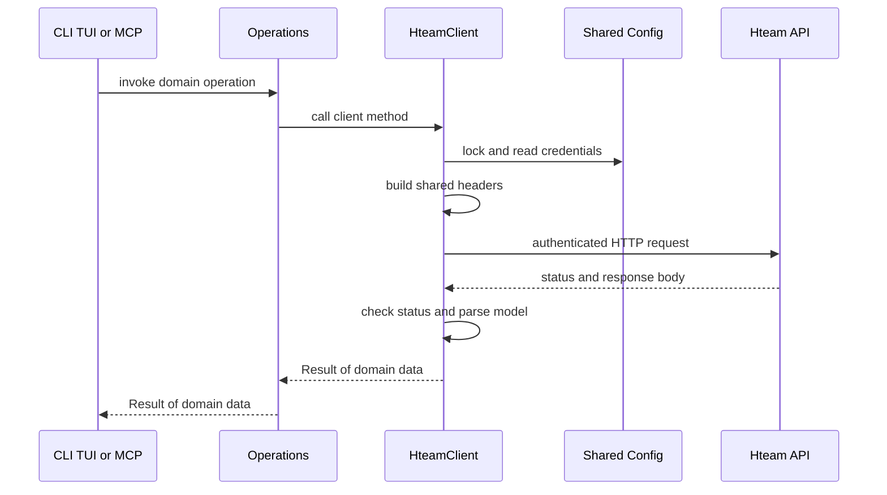
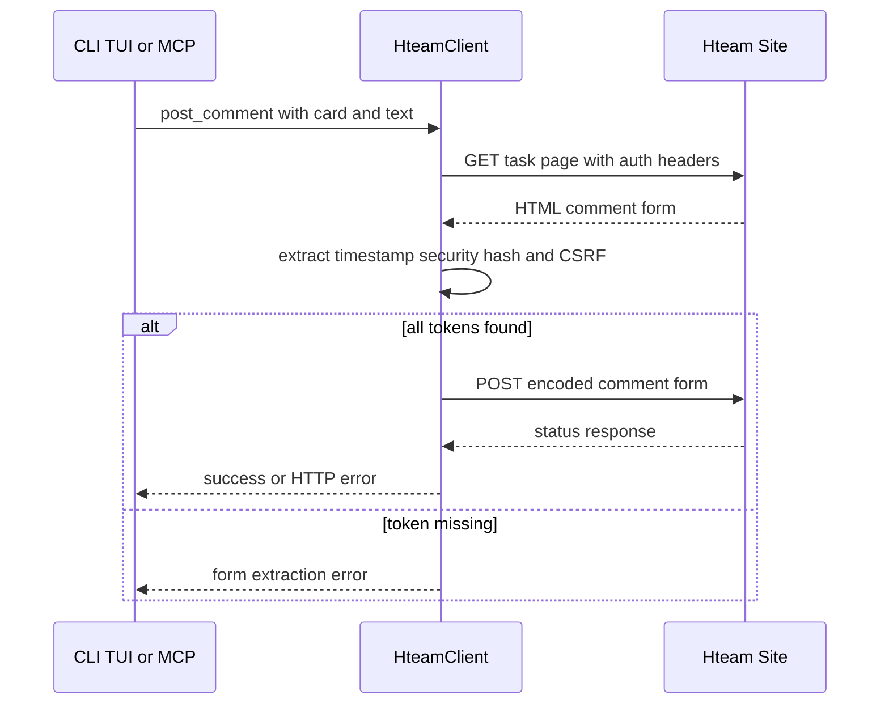

# Hteam HTTP integration contract

`HteamClient` is the exclusive implementation boundary for communication with Hteam. Delivery surfaces and the shared `operations` layer receive a client reference and work with domain models; they do not construct URLs, headers, request bodies, or response parsers. This keeps the quirks of the remote service—two hosts, cookies plus CSRF, JSON and browser-form endpoints, HTML extraction, and inconsistent response shapes—out of CLI, TUI, and MCP code.

## Construction, authentication, and host split

A normal client uses these fixed production bases:

- API endpoints: `https://hteam.mx/api`
- Site/browser endpoints: `https://hteam.mx`

`HteamClient::new` builds one `reqwest::Client` with a 30-second timeout and `curl/7.81.0` user agent, keeps an `Arc<Mutex<Config>>`, and initializes both bases. It deliberately does **not** enable a cookie store: credentials are emitted explicitly on every request. `HteamClient::with_auth` is the entrypoint for authenticated application sessions and refuses a configuration without both `session_id` and `csrf_token`. Login instead creates a client from the candidate configuration, probes a board-list endpoint, and persists the credentials only after a successful response.

Every request starts from shared headers:

- `Referer: https://hteam.mx/`, `X-Requested-With: XMLHttpRequest`, and `Accept: */*`;
- when both cookie values exist, `Cookie: sessionid=…; csrftoken=…` and `X-CSRFToken: …`;
- `Authorization: Bearer …` when an access token is configured.

The client holds configuration in memory, so callers can change its selected board with `set_board_number`. That operation clears the cached internal `board_id`: a board ID from a prior board must never be reused for card creation or movement. In contrast, the board-switch operation owns durable selected-board and display-name persistence, rather than the HTTP client.

This shows the normal authenticated-request path and the ownership boundary between presentation, operations, and HTTP transport.

## Endpoint families and payload conventions

The client exposes domain-oriented methods rather than a generic public request API. The important families are:

| Family | Base and representative routes | Request and response style |
| --- | --- | --- |
| Boards, lists, cards, and labels | API: `/operation/care/operations/`, `/operation/care/operations/{board}/lists/`, `/operation/care/operations/{board}/lists/{list}/cards/`, `/operation/care/tasks/{card}/`, and `/boards/care/…` | Reads use `?format=json` except the board picker, which sends a DataTables query and reads its `data` envelope. Create, move, label, and reminder mutations use JSON. |
| Card edits | Site: `/operations/{board}/tasks/{card}/edit/` | Fetches the current detail first, then posts a URL-encoded browser-form payload that retains all non-patched editable values, adds CSRF, `Origin`, and a route-specific `Referer`. |
| Comments and mentions | Site: `/comments/api/processes-task/{card}/` and `/comments/post/`; API: `/users/username-autocomplete/` | Comment reads are a JSON `results` envelope. Posting requires tokens from the rendered task page and a URL-encoded form. Autocomplete is a GET with `q`. |
| Working state, reminders, and shift | API: `/tr/workingonit/`, `/tr/reminders/`, and `/tr/checkworkshifs/…` | Working start/stop use URL-encoded AJAX-style bodies; reminders and check-in use JSON; reads parse Hteam-specific status models. |
| Project and daily work | API project routes under `/project-new/care/`; site `/history/daily-work` | Project routes return JSON. Daily work sends optional URL-encoded query parameters and parses the returned history HTML. |

`operations` primarily forwards these calls and returns plain data. Its meaningful additions are workflow policy: card update first fetches its patch base, movement defaults its source list to Open (ID 1), and comment date input is validated against `COMMENT_DATE_FORMAT` (`%Y-%m-%d %H:%M`) or defaults to local time. This date is intentionally local/server-style time rather than UTC.

## Browser-form comment posting

A comment is not a single API POST. `post_comment` first retrieves the site task page for the selected board and card, requires `timestamp`, `security_hash`, and `csrfmiddlewaretoken` hidden inputs, then posts the generated form to `/comments/post/`. The form includes the card identity, `processes.task` content type, comment text, local formatted date, and conditionally `follow=on`; it percent-encodes values and sends `Origin` plus the task page as `Referer`. Missing any required token stops the operation before the POST.

This shows the HTML-token-fetch then form-post sequence required for comments.

## Identifier discovery and cache lifecycle

Hteam distinguishes the user-facing board number from an internal `board_id`. When it is absent from configuration, `get_board_id` reads cards from Open list 1 and extracts `board_id` from the first card-list entry. Empty Open is handled by listing board lists and retrying only lists with a positive card count. If no entry yields an ID, creation fails rather than sending an ambiguous request. A successful lookup is cached in the shared config in memory. Switching board clears that cache.

Card creation also needs the current user ID. `get_user_id` first uses its cache; otherwise it reads the active working record. That endpoint only supplies a user while a card is active, so a non-parsing or empty working response falls back to the latest work-shift resume record. A resolved user ID is stored in memory and saved to `config.toml`, reflecting that it is user-scoped rather than session-scoped.

Board-number lookup follows configured `auth.board_number`, then `~/.last_ticket`; methods that accept an explicit board use that argument first. Operations outside the client persist board selections and last-ticket state, while the client only mutates its live board setting and cache.

## Parsing tolerance is deliberate and narrow

Models describe the expected wire fields, including Hteam naming translations such as card `title` to `Card.name`, `subtitle` to description, and `labels_list` to labels. The client adds defensive parsing only where it has evidence that server payload shapes vary:

- Working status accepts an empty body or `null` as no active records, then accepts either an array or one `WorkingOnResponse` object.
- Reminders accept empty or `null` as no reminders, then accept either `{ "reminders": [...] }` or a bare reminder array. A nonempty unrecognized reminder response is treated as an empty result.
- User autocomplete accepts empty or `null`, then tries the documented `{ "results": [...] }` envelope followed by a bare suggestion array; unknown nonempty data is an error with a truncated response excerpt. Suggestions preserve the endpoint's string `id`.
- Create-card accepts a normal `Card` JSON response, but Hteam may respond successfully with an empty body or a card with ID 0. In that case the client tries to find the named card in the requested target list; if it cannot, it returns a placeholder card with ID 0 rather than fabricating an identifier.
- Card-detail labels tolerate an array containing valid label objects and skip malformed members; scalar, string, and other label shapes become an empty label list.

Do not generalize this tolerance to ordinary endpoints: standard malformed JSON still propagates as a parsing error. Daily-work history is explicitly HTML parsing, selecting `#history p`, links, and the expected timestamp pattern; entries without usable text or timestamp are skipped.

## Errors, status handling, and safe extensions

Methods consistently return `anyhow::Result`. Network/send failures gain operation-specific context such as “Error al obtener listas”; most non-success responses fail with the HTTP status and response body. Browser-form mutations and reminders use the equivalent `status >= 400` rule, permitting redirect-class responses from site forms. JSON decoding and HTML parsing errors propagate after status validation. The client does not implement retries, token refresh, or automatic recovery; callers receive one contextual failure and decide how to present it.

When extending the contract:

1. Add the remote call, request encoding, status policy, and model parsing to `HteamClient`, selecting the API or site base intentionally.
2. Reuse `build_headers`; retain special `Origin` or `Referer` requirements for browser-form routes.
3. Add a thin operation that returns domain data and leaves rendering to CLI, TUI, or MCP.
4. Preserve cache scope: clear board-specific values on board changes and persist only values whose scope warrants it.
5. Add a `mockito` test through `new_for_test`, which permits independent API and site base URLs without changing production constants. Test the exact path/query/body and the relevant fallback or parsing branch.

Existing focused tests exercise representative list/card JSON mapping, move and update request bodies, comments and autocomplete delegation, working start/stop payloads, wrapped reminders, project tuple decoding, daily-work HTML extraction, live board DataTables queries, configurable mock hosts, and the requirement that all three comment form tokens be present.

## Related pages

- [System overview](/openwiki/architecture/system-overview.md)
- [Cards and board state](/openwiki/concepts/cards-and-board-state.md)
- [Session configuration](/openwiki/concepts/session-configuration.md)
- [Card mutations and comments](/openwiki/workflows/card-mutations-and-comments.md)
- [Verification strategy](/openwiki/testing/verification-strategy.md)
