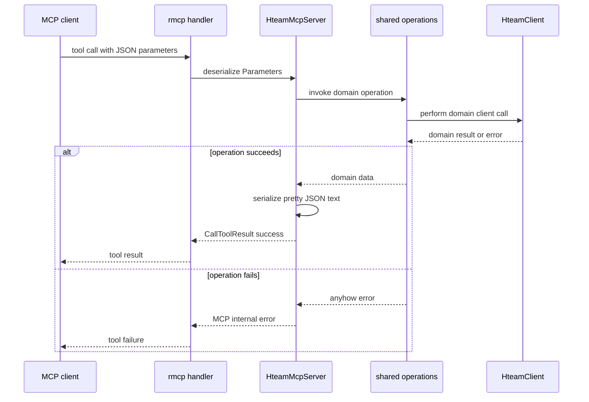

# MCP stdio server and tool surface

`hteam mcp` is the Model Context Protocol (MCP) delivery surface for Hteam operations. The CLI dispatcher invokes `mcp::run`, which opens one authenticated application session and serves an `HteamMcpServer` through rmcp's standard-input/output transport. It is an adapter, not a second API client or business-logic implementation: tools call the shared [`operations` contract](../architecture/system-overview.md), which in turn uses `HteamClient`. Consequently, an MCP tool should preserve the same domain workflow, defaults, authentication behavior, and remote-service handling as the terminal-facing application rather than reimplementing HTTP mechanics. See [Hteam HTTP integration contract](hteam-api.md) for the HTTP boundary and [session configuration](../concepts/session-configuration.md) for credential setup.

## Startup and lifetime

Start the server with:

```bash
hteam mcp
```

The `Mcp` subcommand is dispatched before any MCP transport is created. `run` then calls `Session::open()`: it loads persisted configuration and constructs an authenticated `HteamClient`. Authentication must already be configured; `HteamClient::with_auth` rejects a configuration without the required credentials. Startup failure therefore ends the command rather than starting an unauthenticated MCP server.

The server wraps that client in `Arc<HteamClient>`. `HteamMcpServer` is cloneable, so rmcp handlers can share the same client for the lifetime of the service without reconstructing sessions per tool invocation. `serve(stdio())` establishes the stdio service, and `waiting()` keeps the command alive until the service ends. Errors from either stage are written to standard error with MCP-server or MCP-service context and propagated to the process caller. Protocol traffic belongs on stdio; diagnostics must remain on stderr.



This sequence shows one call after startup; the handler and all calls within a service share the server's authenticated client.

## Schema-to-operation adapter

Each `#[tool]` method is registered by rmcp's `#[tool_router(server_handler)]`. Its single structured argument is generally `Parameters<T>`, where `T` derives both `Deserialize` and `JsonSchema`. This makes the tool input schema and runtime deserialization come from the same Rust parameter type. Required Rust scalars such as `u64` and `String` are required tool inputs; `Option<T>` fields are optional. Field names are the MCP JSON names—use `card_id`, `list_id`, `to_list`, `from_list`, `working_id`, `project_id`, `activity_type`, and so on, not CLI positional syntax or flag spellings.

Parameter policy is intentional and should be retained when adding tools:

- Board-scoped reads and moves accept optional `board`; omitting it delegates selected-board resolution to the client. `lists`, `cards_list`, `cards_open`, `cards_closed`, `card_labels`, `card_move`, and `card_comment` have this form.
- `card_create` takes required `name` and optional `list_id`; it uses the selected board through the underlying operation. `card_detail`, `card_comments`, `card_remind`, and working start require only `card_id`.
- Full `card_update` is the notable strict case: it requires both `card_id` and `board`, while all editable fields (`name`, `description`, `priority`, `responsible`) are optional. The operation reads current card detail before submitting the full patch, so omitted properties retain their patch-base values.
- `card_comment` requires `card_id` and `comment`; optional `follow` defaults to `false`, and optional `date` is passed to the shared comment operation. A supplied date must use `YYYY-MM-DD HH:MM`; omitted or blank dates resolve to current local time.
- `daily_work` accepts optional `user`, `activity_type`, and `range`; the downstream operation supplies its usual default behavior when range is absent. `users_search` requires `query`; project tools require `project_id`; `working_stop` requires a **working-record** ID, not a card ID.

Do not add presentation formatting, URL construction, or Hteam-specific request payloads to a tool handler. The shared operations module explicitly separates plain domain results from CLI, TUI, and MCP presentation. A new MCP capability should first have (or reuse) an operation that accepts `&HteamClient`, then add a schema parameter type and a thin handler that maps fields and selects the MCP result form.

## Tool inventory

The server currently registers 22 tools. The grouping below describes its public surface; detailed remote endpoints and mutation protocols deliberately remain in the shared operations and Hteam-client contract.

| Domain | Tools | Purpose and key inputs |
| --- | --- | --- |
| Boards and card queries | `lists`, `cards_list`, `cards_open`, `cards_closed`, `card_detail`, `card_labels` | List board lists; list a specified list; read the conventionally Open (list 1) or Closed (list 2) cards; and retrieve a card or its labels. List and open/closed queries can override `board`; card detail does not take a board. |
| Card mutations | `card_create`, `card_move`, `card_update_desc`, `card_update`, `card_remind` | Create by name, move between lists, update only description, apply a full card patch, or create a reminder. `card_move` uses Open list 1 when `from_list` is omitted. |
| Comments | `card_comments`, `card_comment` | Retrieve comments or post text with optional board, follow flag, and local-time date. |
| Working on it | `working_list`, `working_start`, `working_stop` | Read active work, start it for a card, or stop it by `working_id`. The latter identifier comes from `working_list`. |
| Projects | `project_milestones`, `project_tasks` | Read a project's milestone progress or task/status/responsibility data by `project_id`. |
| People and personal/team activity | `users_search`, `reminders`, `check_in`, `daily_work` | Search users, list pending reminders, check in, and read daily-work history with optional filters. |

Tool names are stable integration names, independent of the CLI command hierarchy. Tools return domain models rather than terminal tables; for example, `cards_list` intentionally returns only the card vector even though the shared operation also obtains an optional board ID.

## Results and failure semantics

Every successful handler passes its value through `ok`. It serializes the value with `serde_json::to_string_pretty` and returns exactly one MCP text content item in `CallToolResult::success`. Thus callers receive pretty-printed JSON encoded as text, consistently for reads, created-card objects, check-in results, and mutation acknowledgements. Actions without a useful domain response return explicit JSON confirmation objects, such as `{"success": true, "card_id": ...}`, `{"success": true, "card_id": ..., "to_list": ...}`, or `{"success": true, "working_id": ...}`. This is distinct from CLI human tables and aligns programmatic tool output across all 22 methods.

An operation's `anyhow::Error` is mapped to `McpError::internal_error` with its message. Serialization failures follow the same MCP internal-error path. Therefore, remote HTTP failures, authentication/configuration problems discovered during operation execution, validation failures such as an invalid comment date, and data-processing failures are surfaced to the MCP client as internal errors rather than successful text containing an error message. Tool extensions should retain this `map_err(err)?` pattern: do not silently turn a failed mutation into a success acknowledgement, and do not introduce tool-local error formatting that diverges from the shared operation.

## Safe extension and verification

When adding a tool, keep the boundary sequence: implement or reuse the domain operation, define a `Deserialize + JsonSchema` parameter struct, add the `#[tool]` handler in `HteamMcpServer`, delegate to the operation, and return `ok(value)` or a clearly scoped success acknowledgement only after it succeeds. Be especially careful with defaults already centralized by operations: movement defaults `from_list` to 1, full updates fetch their patch base, comment timestamps use local format/defaulting, and stopping work requires the working record rather than the card.

There are focused mock-backed tests at the operations boundary for representative behavior: card-list delegation, Open-source movement, and two-step full update; comments test parsing and date validation; working tests verify record identity and start/stop requests. This reflects the intended testing boundary for a thin MCP adapter: protect behavior and HTTP contract in `operations`/`HteamClient`, then add MCP-specific tests when a schema mapping, result envelope, or error translation introduces logic that delegation tests cannot cover.
