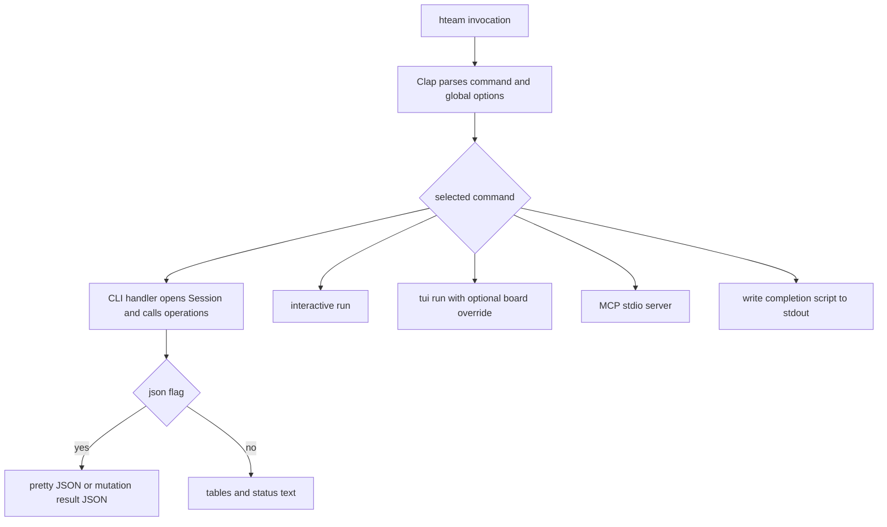
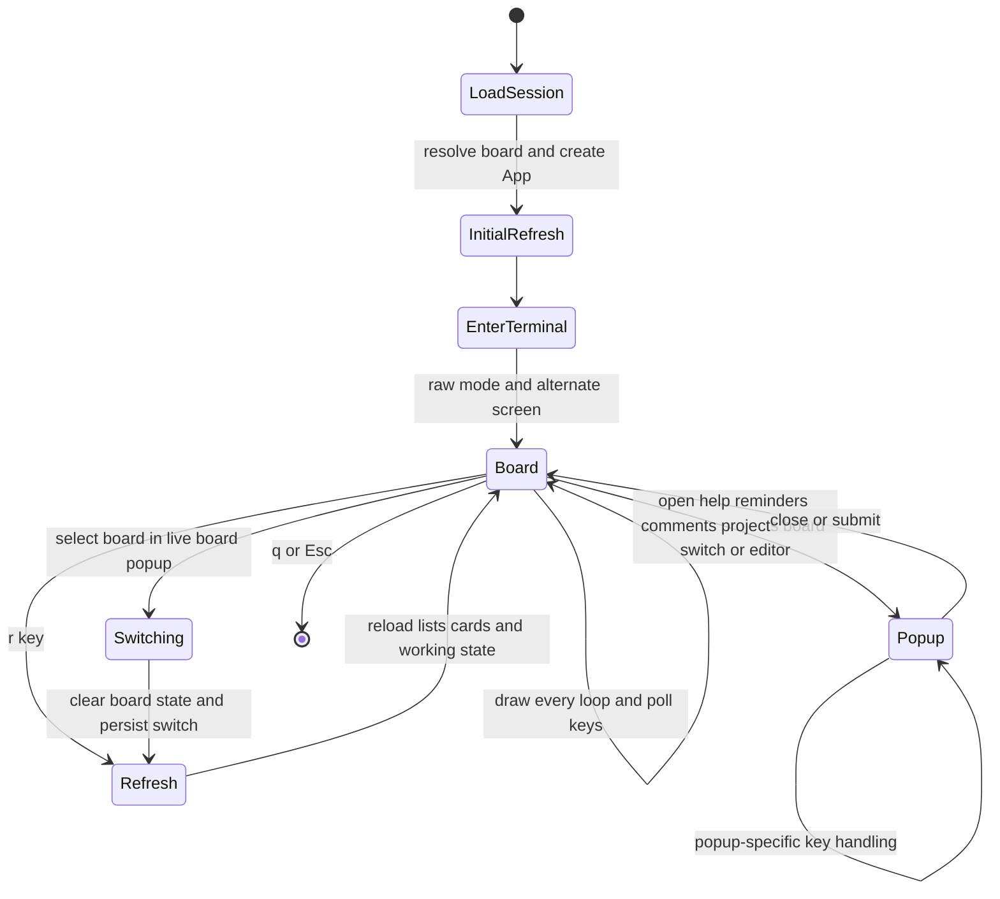
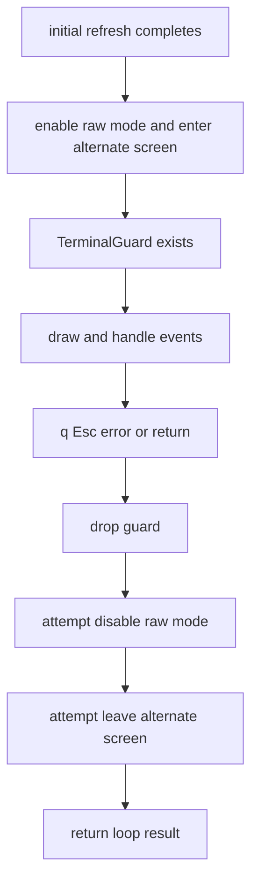

# CLI, REPL, and Kanban TUI behavior

`hteam` has three human-facing terminal experiences over the same operations and authenticated client layer:

- the Clap command-line interface for one-shot commands and optional JSON output;
- `hteam interactive`, a line-oriented REPL that parses a small command vocabulary and delegates its work to CLI handlers; and
- `hteam tui`, a Ratatui/Crossterm Kanban board that holds a richer **in-memory** interaction state.

The CLI router also exposes MCP, but that stdio server is a separate integration surface rather than a terminal UI. See [MCP server](/openwiki/integrations/mcp-server.md). Shared board and card semantics are covered in [Cards and board state](/openwiki/concepts/cards-and-board-state.md), while persisted credentials and board configuration are covered in [Session configuration](/openwiki/concepts/session-configuration.md).

## One-shot CLI

`Cli::parse()` constructs the Clap command tree, then `cli::run` dispatches exactly one subcommand asynchronously. The global `--board` option selects a board for commands that accept it, and global `--json` is passed to most human-facing list and mutation handlers. Commands include board management, list/card operations, open/closed views, working-on-it, projects, check-in, reminders, daily work, user search, the REPL, TUI, MCP, and shell-completion generation.

This diagram shows top-level dispatch and the two output modes used by the ordinary CLI handlers.

### Output and failure behavior

The card handlers open a `Session`, invoke `operations`, then either serialize returned values with `serde_json::to_string_pretty` or render a rounded `tabled` table and human-oriented messages. Empty result sets are successful and rendered as explanatory text. Mutations such as move, description update, comment, update, and reminder produce small success JSON objects when `--json` is selected. Errors from opening the session, resolving a required board, serialization, or an operation propagate as the command error rather than being converted to successful output.

Board commands are different: `board list` uses `--json`, but `board switch` and `board current` print human text. A board switch writes the active board into configuration, updates the board-name map and last-used time, and writes the last-ticket file. This durable active-board change is subsequently available to every runtime.

For card movement, the shared operation defaults an omitted source list to list `1` (Open). Callers that need an exact source should therefore supply `--from`; the TUI does supply the selected source list. Card creation and description update resolve their board through the client configuration when no explicit board is carried by that operation.

## REPL: a convenience dispatcher, not a second operations implementation

`hteam interactive` creates a Rustyline editor, loads `~/.hteam_history` when present (falling back to `.hteam_history` if a home directory is unavailable), shows the configured active board, and loops on the `hteam> ` prompt. Every nonblank submitted line is added to history; history is saved best-effort when the loop ends. Ctrl+C does not exit—it reminds the user to use `exit` or Ctrl+D—while Ctrl+D ends the loop. A command-processing error is printed in red and the REPL continues.

The REPL splits input on whitespace, so it does not implement shell-style quoting. Its board, list, card, move, detail, working, and comment commands construct the corresponding CLI argument types and call `cli::board`, `cli::cards`, or `cli::working` handlers with `json = false`. This delegation preserves the operations behavior and output conventions of the CLI instead of duplicating API calls. REPL-specific commands are help, screen clear, exit aliases, configuration display, and `!`.

> **Operational caution:** `! <command>` joins the remaining words and executes `sh -c <command>`. It deliberately runs a local shell command with the user’s privileges; it is not an Hteam API command and should not be enabled or suggested in an untrusted-input workflow.

## TUI lifecycle and state ownership

`hteam tui [--board N]` opens a session and resolves its initial board from the command-line override or configured/default board resolution. It loads `tui.hidden_lists`, `tui.known_projects`, and `[working_hours]` from `config.toml`, constructs `App`, performs an initial refresh, then enters raw mode and the alternate screen.

`App` is the owner of transient display and interaction state: downloaded lists, cards indexed by list, working-on records, current selection, popup/input flags, comments, reminders, fetched boards, project detail, scroll offsets, and the short-lived footer status. It intentionally fetches cards for **all** lists, including hidden ones, so unhiding a list does not require another card request. Selections are clamped after refresh and movement is bounded; each list retains its own selected-card index.

The TUI persists only explicit durable choices or diagnostic output, not its complete UI snapshot:

- `v` hides the selected list by case-insensitive name and `V` clears that filter; both write `[tui] hidden_lists`.
- Loading a project makes its ID most-recently-used in `[tui] known_projects`.
- Selecting a different board persists the active board through the shared board-switch operation (including config and last-ticket state).
- Status messages are transient in the footer and expire after three seconds, but are appended best-effort to `~/.config/hteam/tui.log` for diagnosis. Failure to create or append that log never fails the interaction.

The configured working-hours window is read-only TUI input: when local time is inside valid `HH:MM` start/end bounds, the title bar shows remaining time. The header may also show the last check-in/check-out record. Neither is a TUI preference mutation.

### Event, popup, and refresh flow

This state diagram shows the TUI’s event-routing priority: an open popup consumes keys before normal board navigation, while refresh and board switching return to the same board loop.

Each loop expires an old status, draws the board and at most one highest-priority popup, then polls for up to 200 ms. Only key press events are processed. Normal navigation uses `j`/`k` or arrows for cards and `h`/`l` or arrows for lists; `q`/Esc exits. `r` invokes `refresh_all`, which sets a loading status, refreshes user shift, lists, cards for every list, and working-on state. If listing lists fails, existing in-memory board data remains and the footer records the error. Once lists load, the cards map is cleared and rebuilt; an individual list failure is surfaced as a status after other lists are attempted. User-shift and working-state refresh failures are nonfatal and retain their prior values.

The board supports inline card movement, new cards, working-on toggling, list visibility, reminders, descriptions, comments with mention lookup, projects, help, and live board selection. Popups load their relevant remote data when opened where applicable: reminders, comments, boards, and project milestones/tasks. Input modes validate locally where practical—for example project IDs accept digits only, comment dates allow only date-format characters, and an empty new-card name is rejected with footer feedback.

### Mutation consistency and feedback

Moving a card with `H` or `L` is optimistic: the TUI removes it from the source collection and adds it to the target before invoking the operation. On success it selects the moved card in the target list; on failure it removes the optimistic target copy, reinserts it at its former source position, and places the error in the footer. Other successful mutations refresh the affected representation: description save reloads the current list, card creation reloads its list, comment submission reloads comments, reminder creation reloads reminders, and working-on start/stop refreshes working records.

Every status write is logged best-effort and becomes the footer message. Thus request failures remain visible without terminating the interactive process. Most popups can be cancelled with Esc; description submission deliberately closes its editor before saving, so both success and failure return the user to the board with feedback.

### Board switching is a state boundary

The `B` popup obtains live boards from the API, preselects the current board, and can retry its fetch with `r`. Confirming another board clears downloaded lists, cards, selections, and working-on state; updates both `App.board_number` and the client’s cached board number; closes the popup; persists the selected board; then performs a full refresh. Updating the client cache is essential: create-card and description-update operations resolve their board internally from that cache, so failing to update it would make a board that looks switched in the UI mutate the previous board.

## Terminal restoration guard

The terminal guard owns the successful transition into raw mode and the alternate screen. It is created after the initial remote refresh, so startup API feedback occurs in the ordinary terminal. Its `Drop` implementation attempts both restoration operations and ignores cleanup errors. The explicit `drop(guard)` before returning the run-loop result makes restoration happen before the caller observes that result; Rust unwinding/early return after guard construction also drops it.

This diagram shows cleanup after a successfully constructed guard. `TerminalGuard::enter` enables raw mode before entering the alternate screen; if entering that screen itself fails, construction fails before a guard exists, so that partial-entry failure is not covered by `Drop`.

## Change and test guidance

Keep command parsing and presentation in `src/cli`, and put API behavior in `operations`; REPL additions should call existing CLI handlers when possible. TUI changes should add fields to `App` only for state that must survive redraws during the process, explicitly decide whether a user choice merits config persistence, and set a status for recoverable failures. Any mutation that changes the cached board must keep `App` and `HteamClient` synchronized before calling operations that resolve the board from client configuration.

There are no TUI-specific test modules in the inspected source. The important focused coverage is in operation and client tests using `mockito`, including live-board list parsing and configured-board display behavior, plus card-operation delegation tests. Add tests around extraction-friendly state transitions or mocked operations when changing refresh, rollback, persistence, or board-switch semantics; UI drawing and terminal-mode cleanup currently rely on code review and integration-level manual verification.
