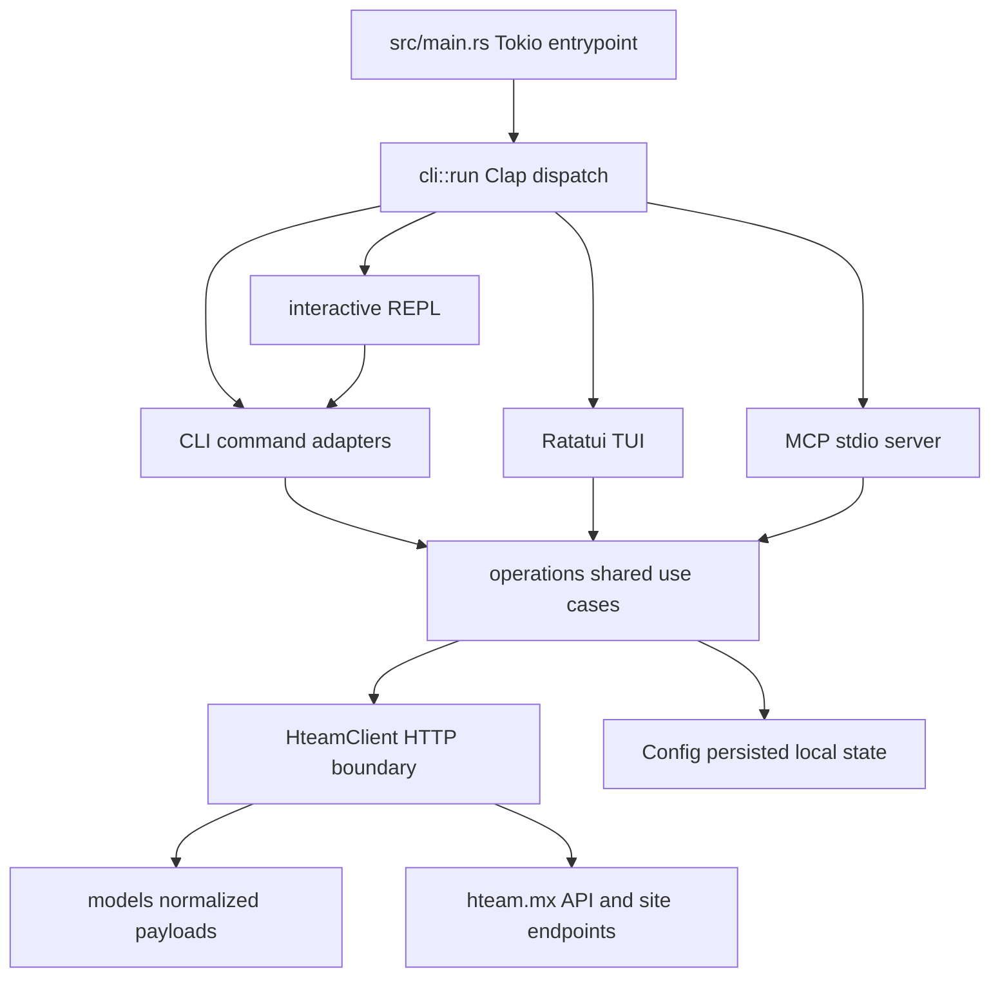

# Hteam CLI: guía de orientación

`hteam` is a Rust command-line application for Hteam boards. The executable is the `hteam` package binary: `src/main.rs` starts Tokio and calls `cli::run()`. Clap then selects the conventional command surface or one of three long-lived adapters: `hteam interactive` (REPL), `hteam tui` (Kanban terminal UI), or `hteam mcp` (an MCP server on standard I/O). These are alternate ways to use one application core, not separate products.

Start here to find the safe change seam; use the linked pages for behavior and protocol details rather than duplicating them in an adapter.

## Before changing anything

Repository workflow is a hard constraint, including for a small change:

1. Run `./init.sh` **before** work. It validates the harness and feature state, then runs `cargo fmt --check`, Clippy with warnings denied, and `cargo test --all-features`. Stop and fix the environment if it fails.
2. Read `progress/current.md` and `feature_list.json`. When working from the backlog, select only one pending feature, mark it `in_progress`, and keep the progress record current while working. For a direct request, still keep the progress record current.
3. Read `docs/architecture.md` before implementation and `docs/verification.md` before claiming completion. Do not claim a task is done without a second green `./init.sh`; then update feature and progress/history state according to the repository closeout process.

The smallest relevant test is useful while iterating, but it does not replace the final repository gate. See [Testing and change verification](/openwiki/testing/verification-strategy.md) for mock HTTP, surface-level test, and interactive smoke-test expectations.

## The binary and its boundaries

This is the ownership path for a user or tool request: presentation adapters translate their native input and output, operations coordinate shared behavior, and `HteamClient` alone crosses the remote boundary.

| If the change is about… | Start at | Ownership rule |
| --- | --- | --- |
| A flag, subcommand, human-readable table/message, raw `--json` output, or shell completion | [Terminal experiences](/openwiki/operations/terminal-experiences.md) | Keep Clap parsing and rendering in `cli/`; put reusable decisions below it. |
| REPL shortcuts/history or TUI keyboard, popup, refresh, selection, and terminal lifecycle | [Terminal experiences](/openwiki/operations/terminal-experiences.md) | UI/REPL state is adapter-owned; call operations for domain actions. |
| A reusable card, board, comment, reminder, project, user, check-in, daily-work, or working-on-it use case | [System architecture and ownership boundaries](/openwiki/architecture/system-overview.md) and [Cards and board state](/openwiki/concepts/cards-and-board-state.md) | Add the shared rule or sequence in `operations/`; return domain data rather than print or render. |
| Cookie/bearer authentication, a URL, header, request payload, status handling, response quirk, or remote identifier discovery | [Hteam HTTP integration](/openwiki/integrations/hteam-api.md) | Extend `client::HteamClient`; do not send Hteam HTTP from an adapter. |
| `config.toml`, board selection, cached identifiers, last-used board, or durable TUI/REPL preferences | [Authentication, sessions, and persisted preferences](/openwiki/concepts/session-configuration.md) | `Config` owns local disk state; make writes and lifecycle explicit. |
| An MCP tool name, JSON schema, stdio server behavior, or MCP error/result translation | [MCP stdio server and tool surface](/openwiki/integrations/mcp-server.md) | Decode parameters and encode MCP results in `mcp/`; delegate the use case to operations. |
| A card create/move/update/comment/reminder or working-on-it behavior that spans discovery and mutation | [Card mutation and comment workflows](/openwiki/workflows/card-mutations-and-comments.md) | Preserve its ordering, identifier requirements, defaults, and refresh/failure behavior. |
| What to test and how to prove the change | [Testing and change verification](/openwiki/testing/verification-strategy.md) | Test at the seam that owns the behavior; never make live Hteam requests in tests. |

## How a normal command reaches Hteam

For an authenticated action, the adapter commonly opens `operations::Session`, which loads `Config` and constructs `HteamClient::with_auth` from a cloned configuration. Authentication requires both `session_id` and `csrf_token`; absent credentials fail before the request. The operation then calls a client method and gives domain data or an error back to the adapter, which decides whether that becomes a table, JSON, UI feedback, or an MCP result.

`HteamClient` owns the reqwest client, Hteam API/site base URLs, request headers, manual session and CSRF cookies, optional bearer authorization, timeouts, status failures, and response parsing into `models`. Keep endpoint-specific workarounds there. `models` is the anti-corruption boundary for external payload shapes; do not make every CLI, TUI, or MCP caller parse ad-hoc JSON.

The board resolver is a shared invariant: an explicit override wins, then the configured default board, then the board stored in `~/.last_ticket`. Reuse `operations::resolve_board_number` rather than creating feature-specific fallback logic. Board switching persists both the configuration and last-ticket state. The deeper rationale and state lifecycle belong in [Session configuration](/openwiki/concepts/session-configuration.md).

## Safe extension recipe

1. Identify the behavior and the page above that defines its domain contract.
2. Put a new remote request or API protocol handling in `HteamClient`; extend models when a payload needs normalization.
3. Put cross-surface validation, defaults, ordering, and multi-request orchestration in an `operations` module. Operations accept `&HteamClient` and, only when durable preferences change, `&mut Config`; they return data rather than terminal or protocol formatting.
4. Add thin glue in the intended adapter: Clap input/output in `cli/`, event and ephemeral state in `tui/`, readline routing/history in the REPL, or schemas/MCP conversion in `mcp/`.
5. Add focused tests for every touched module. Use `mockito` and the test client for HTTP paths; add an integration test for a new CLI subcommand or MCP tool; manually smoke-test changed interactive behavior and record the observation.
6. Run `./init.sh` again. Only a green gate, current progress/feature state, and required closeout records permit declaring completion.

### Common mistakes to avoid

- Do not put a direct `reqwest` call, Hteam URL, cookie/header construction, or API response workaround in `cli/`, `tui/`, the REPL, or `mcp/`.
- Do not put a business default merely in one presentation surface. For example, card movement defaults an omitted source list to Open (`1`) in operations so CLI, TUI, and MCP agree.
- Do not turn a partial card update into a blind partial payload: the shared update operation first gets current card detail because the client constructs the full patch from that base.
- Do not assume a config mutation updates every client copy: a session contains loaded config and a client initialized from its clone, so persist state through the owning operation.
- Do not treat a passing compile, an unasserted HTTP request, or a live API call as sufficient verification.

For the complete layer contract, start with [System architecture and ownership boundaries](/openwiki/architecture/system-overview.md). For names and IDs that are easy to confuse—particularly lists, cards, labels, board IDs, and working-on-it records—read [Cards and board state](/openwiki/concepts/cards-and-board-state.md) before modifying a mutation path.
