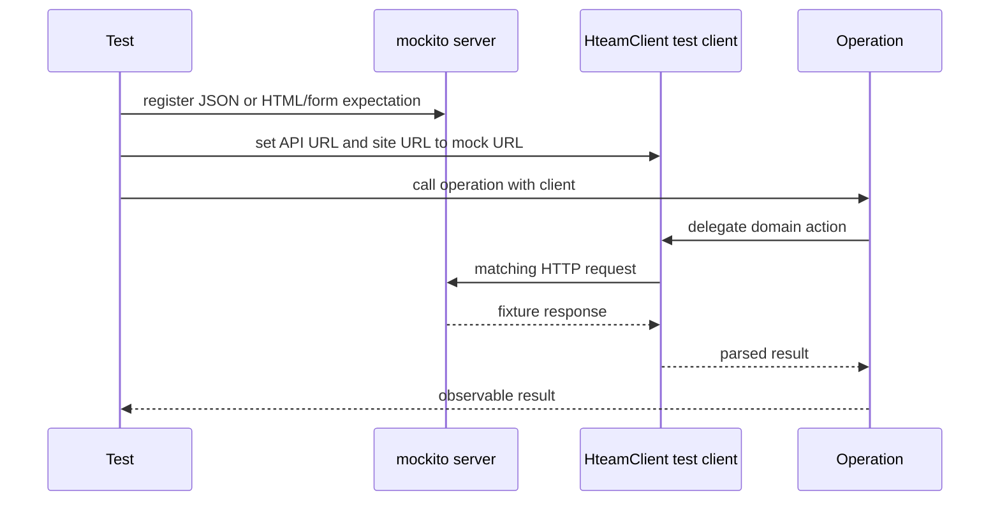

# Testing and change verification

Verification in this repository is evidence-driven: a change is not complete because it compiles or appears plausible. It must pass the repository gates and include a focused test for every module created or modified. This is a forward-looking rule, rather than a mandate to retrofit every untouched module, but it applies to all new work immediately.

Run `./init.sh` at the **start** of a work session and again before declaring work complete. A non-zero exit means the environment or repository is not ready and work must not advance or be marked done. The script checks the required harness files, validates feature statuses (at most one `in_progress` feature and only recognized status values), then runs formatting, Clippy, and the full feature-enabled test suite.

## Required executable gates

The normal closing gate is:

```bash
./init.sh
```

`init.sh` executes the following checks itself, so its final successful exit is the authoritative completion signal:

```bash
cargo fmt --check
cargo clippy --all-targets --all-features -- -D warnings
cargo test --all-features
```

When iterating, run the smallest relevant test first, then the complete gate before completion. Formatting failures should be corrected with `cargo fmt`; warnings are failures because Clippy is invoked with `-D warnings`. A narrowly scoped `#[allow(...)]` is only acceptable for a justified false positive, not as a blanket escape hatch.

The completion review also checks that business logic stays in `operations/`, HTTP remains centralized in `client/mod.rs`, touched modules have passing tests, and no real `hteam.mx` request occurs in tests. A finished feature must have passing associated tests, while closing the session additionally requires a cleanly maintained progress/history record and archived session reports.

## Test placement and scope

Place a module-focused unit test in its Rust file with `#[cfg(test)] mod tests`, or add an integration test under `tests/integration/` when validating an actual CLI or MCP delivery surface. Test names should describe the observable contract, such as `test_resolve_board_number_prefers_override`, rather than merely the implementation under test.

The architectural boundary determines what to test:

- **`operations/`, `client/`, `models/`, and `config/`:** every changed or created module needs focused automated coverage. Operations are intentionally presentation-free adapters over `HteamClient`, so test returned domain data, delegation, defaulting, persistence effects, and error behavior rather than CLI formatting.
- **`client/`:** test request construction and response parsing against a local mock. This is where JSON endpoints and site/form protocols are encoded, so match HTTP method, path, query string, relevant headers or form fields, and concrete parsed outcomes.
- **CLI or MCP additions:** add an integration test as part of the feature. It must drive the compiled binary or the public end-to-end entrypoint/tool behavior against a mock server and verify the user/tool-visible result and request contract.
- **TUI or interactive REPL changes:** retain a focused automated test wherever the logic can be separated from terminal I/O; additionally perform and record a manual smoke test. The TUI's raw-mode/alternate-screen lifecycle and event loop are not adequately proven by a test that merely avoids panicking.

## Isolated Hteam HTTP tests with `mockito`

`mockito` is the repository's development dependency for HTTP tests. Remote Hteam calls are never permitted in tests. Build a `mockito::Server`, install only the expected mock routes, and create a client with `HteamClient::new_for_test`. Crucially, pass `server.url()` for **both** `api_base_url` and `site_base_url` unless a test deliberately needs to prove one side separately. The production client has two base URLs: API-oriented calls and site-oriented HTML/form calls; the test constructor redirects both independently.



This shows the test client redirecting both protocol families to the local `mockito` server.

Use async server and mock creation for async client calls. Match query parameters for JSON reads, and use `Matcher::PartialJson` or form/body matchers for mutations. Keep response fixtures minimal but representative of the fields the model/parser consumes. The test itself should assert returned values or the mutation's exact contract; a successful request with no behavioral assertion is insufficient.

The same technique covers distinct client protocols:

- **JSON:** board/list/card endpoints are tested with JSON response bodies and required `format=json` or datatable query parameters.
- **HTML and form flows:** the client’s site URL is used for workflows such as fetching page content or posting forms. Mock the HTML fixture when token extraction matters, then match submitted URL-encoded fields, including values that must be preserved by an update patch.
- **Authentication isolation:** test configurations can include deterministic board and CSRF values. Requests remain local even though the production client normally adds cookies, CSRF headers, bearer authorization when configured, and an AJAX header.

## Existing operation contracts covered by tests

Current operation tests illustrate the level of behavior a changed operation must preserve:

| Area | Verified behavior | Why it matters when changing code |
| --- | --- | --- |
| Live boards | A datatables response is requested with `format=datatables` and `status=Execution`, parsed into `BoardEntry` values, including id and name. | Preserves the TUI board-switch data path. |
| Board display | A configured board returns its saved name; an unknown configured id uses `Desconocido`. | Keeps the UI usable when cached metadata is absent. |
| Lists and cards | List and card routes include the board and JSON-format query; cards return both parsed cards and the response board id. | Prevents accidental loss of board context. |
| Card move | Missing `from_list` defaults to list `1` (Open) and the position request contains that source, target, card, and board. | CLI, TUI, and MCP share this default. |
| Card update | Updating first fetches detail, then submits a full form patch whose changed name, description, priority, and id are present. | The fetch is required because the client builds the update from current detail rather than sending a partial JSON document. |
| Comments | Comment listing parses `results`; mention lookup includes its `q` query; dates accept the declared format and reject invalid input; an unfinished end-of-line `@mention` is the only mention query. | Protects comment composition and follow-up-date validation. |
| Working status | Listing parses the API array; start and stop use their respective method, endpoint, and form data; stopping uses the working-record id found for a card, not the card id. | Avoids stopping the wrong resource. |
| Board resolution | An explicit board override takes precedence over configured default, which precedes the last ticket fallback. | All surfaces should reuse one resolution policy. |

When adding a behavior, extend these focused tests or add a new one for the newly introduced invariant. Do not weaken an existing request matcher merely to accommodate an implementation change: update the matcher only if the intended wire contract changed deliberately.

## New CLI and MCP surface expectations

A delivery-surface feature has two responsibilities: preserve the thin-adapter architecture and prove the complete exposed behavior. Put shared decisions in `operations/`; CLI commands, TUI actions, and MCP tools should call those operations rather than independently reconstruct HTTP sequences. The MCP server serializes successful operation results as pretty JSON text in `CallToolResult` and converts operation failures to MCP internal errors, while its stdio entrypoint opens an authenticated `Session` before serving.

For a new CLI subcommand or MCP tool, add an integration test that:

1. creates a `mockito` server and redirects API **and** site bases through the test client or the injectable public path;
2. supplies deterministic configuration/authentication and mock JSON, HTML, or form responses for every expected request;
3. invokes the CLI command or MCP tool through its public behavior rather than only testing a private helper;
4. asserts visible output/result semantics and the mock's method, route, query, and mutation body; and
5. covers failure translation where the new surface changes user-visible or tool-visible errors.

The standard targeted command documented for integration work is:

```bash
cargo test --test integration
```

Run it when that target exists for the feature, then still run the full `./init.sh` completion gate. Never substitute live credentials or a real `hteam.mx` request for a fixture.

## Manual smoke tests for interactive interfaces

Interactive changes need a deliberate manual pass in addition to the gates. Start the relevant surface only with a safe test account/environment and exercise the changed workflow end-to-end. For the TUI, confirm initial refresh, keyboard navigation, the changed modal/input/action, success and failure status feedback, and orderly exit that restores normal terminal mode. The TUI enters raw mode and the alternate screen through a guard whose `Drop` restores both; smoke testing should explicitly verify that an error or normal exit does not leave the terminal unusable.

For the Rustyline interactive CLI, verify prompt startup, the changed command, readable error handling, `help` if command discovery changed, and `exit`/Ctrl-D history persistence. Record what was run, the expected and observed result, and any limitation in `progress/current.md`; do not write only “works.” If a UI change touches a module, it still needs its own focused test—the smoke test supplements, never replaces, that requirement.

## Completion checklist

Before completion:

- Run `./init.sh` at session start and rerun it at the end; do not declare completion on failure.
- Add or update at least one focused passing test for **every** created or modified module.
- Keep all test traffic local to `mockito`; redirect both client base URLs for workflows that can cross JSON and site/form endpoints.
- Run the applicable CLI/MCP integration test for every new command/tool, then the full feature-enabled gates.
- Manually smoke-test interactive changes and document the observed workflow in `progress/current.md`.
- Leave the repository and feature/progress state ready for the checkpoint review rather than relying on an unsupported assertion that the change works.
