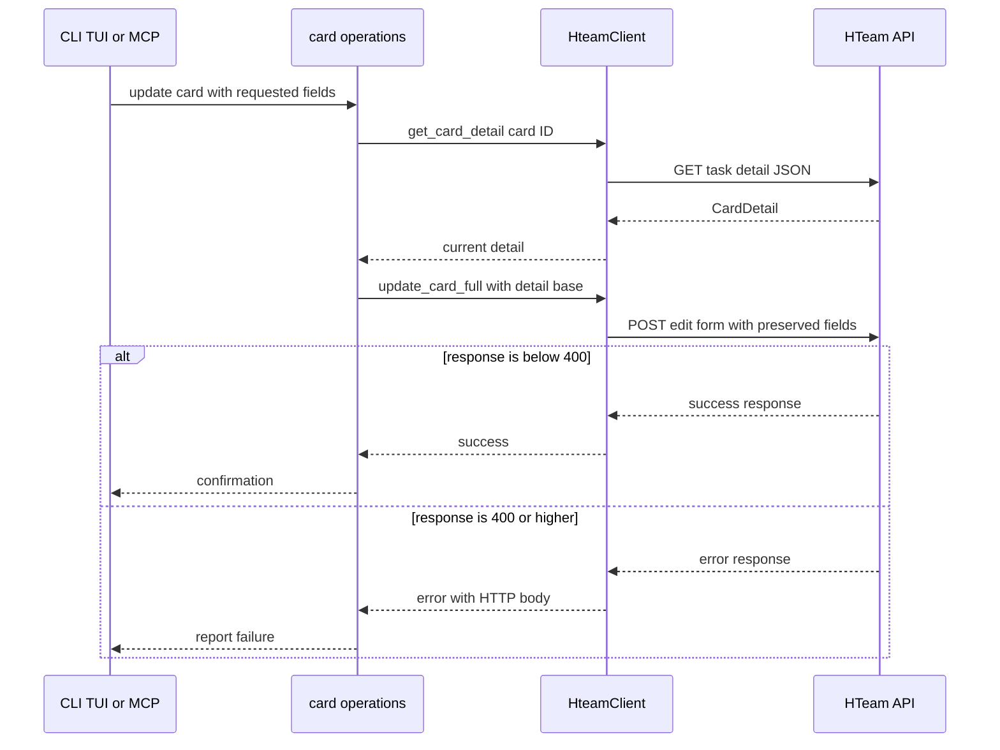
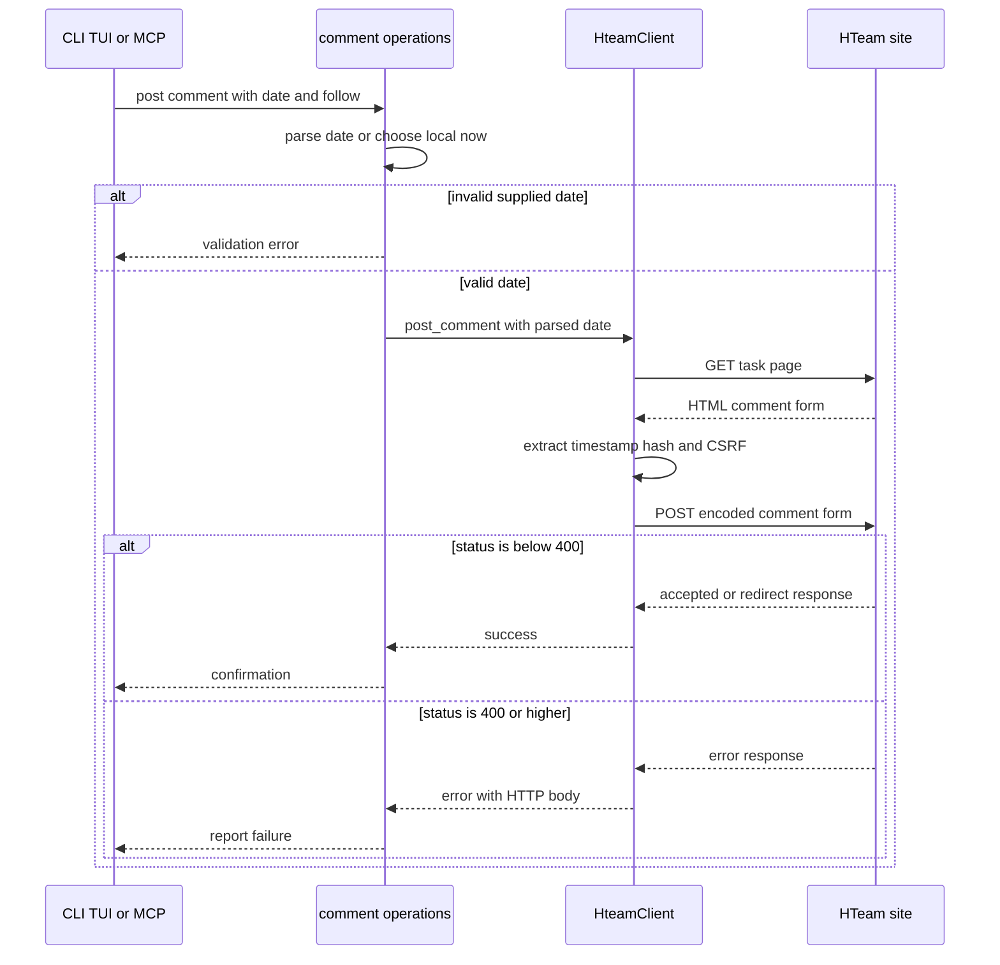
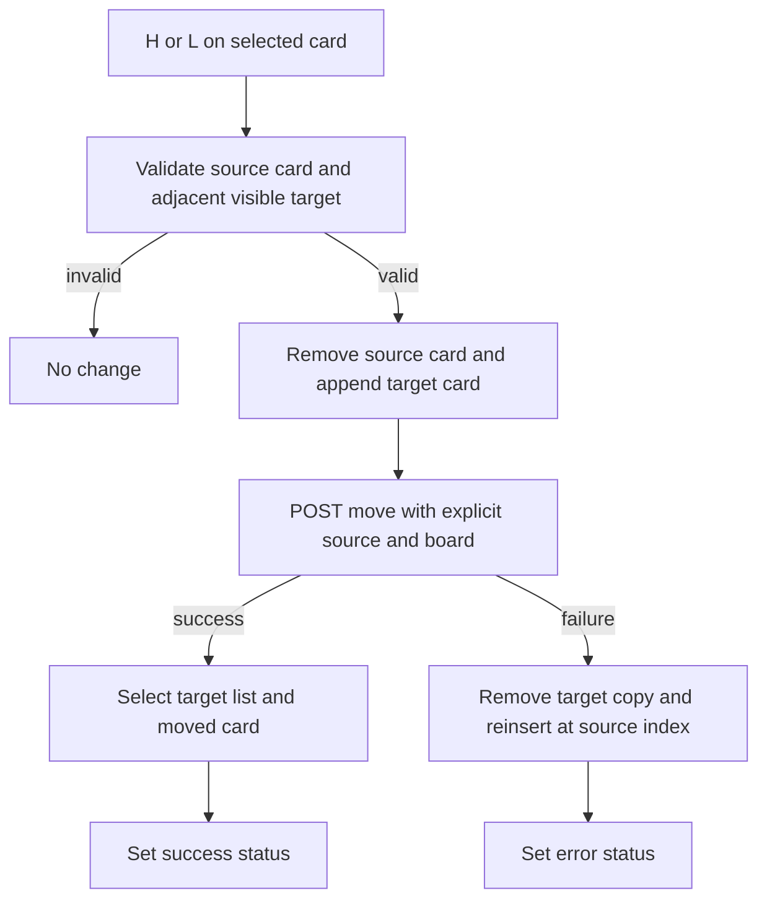

# Card mutation and comment workflows

Card-changing features are delivered through thin CLI, TUI, and MCP adapters over `operations`, which owns presentation-independent orchestration, and `HteamClient`, which owns authenticated HTTP details. This separation means a change to mutation semantics should normally be implemented and tested in the operation/client layer, then surfaced consistently by each interface.

## Preconditions and discovery

Every CLI card command opens a `Session`; that loads configuration and refuses to construct a client unless authentication is present. The client adds the session and CSRF cookies, CSRF header when available, bearer authorization when available, `Referer`, and AJAX-style headers to requests. Board selection follows one consistent precedence: an explicit board, the configured board, then the last board saved by the TUI or board-switch command. A missing board is an error for flows that require one.

Discovery is not optional plumbing in several mutations:

- List and card reads use the board-number API. The cards response is unwrapped from `cardlist_list` and may yield the internal `board_id` from its first entry.
- `create_card` needs both the board number and internal board ID. `get_board_id` first uses its in-memory cache; otherwise it probes list **1** (Open), and if Open is empty, scans lists with cards until it finds an entry carrying a board ID. It caches the result. Changing the active board invalidates that cache before subsequent mutations.
- Creating also needs a user ID. It uses a cached value first, otherwise checks the active working-on response (array or object) and falls back to the most recent work-shift record. A resolved user ID is persisted in configuration.
- Full updates first fetch card detail. The edit endpoint is form-oriented rather than a partial JSON API, so the current detail is the base that preserves fields not being changed.

> **Safe caller rule:** pass the current source list when it is known. The shared `move_card` operation defaults an omitted source to list **1**, Open; this is convenient for CLI/MCP callers but is wrong when the card is known to be in another list. The TUI therefore always supplies its visible source-list ID.

## Card creation, movement, and patching

### Create a card despite an inconsistent response

Creation posts JSON with `name`, the resolved user as `complement`, the board number as `process`, and an optional destination list encoded as `labels`. The API may return an empty successful body, invalid/non-card JSON, or a decoded card with ID `0`. In all of those cases, the client attempts a name lookup in the requested target list. If that lookup cannot find the card—or no list was supplied—it deliberately returns a minimal success-shaped `Card` with ID `0` and the supplied name rather than treating the successful create response as a parsing failure.

This fallback is useful for a user-facing confirmation, but it is not a durable identifier: callers needing to mutate the newly created card should refresh the destination list and select the real card rather than use `id: 0`. The TUI already does this refresh after a successful creation.

### Move a card

Moves POST JSON to `boards/care/labels/update_card_position/` with a board number, card ID, source list, destination list, and `card_type: 0`. Success means any 2xx status; HTTP failures preserve their response body in the reported error. CLI JSON and text confirmations display source list 1 when `--from` is omitted, matching the operation default.

### Full update sequence

A full update can change name, description, priority, and responsible user. The CLI resolves an explicit/configured/last-used board before invoking it; MCP receives its required board parameter. The operation fetches detail first, then constructs a form submission that substitutes only supplied values and retains `time_estimated`, `start_date`, `dependence`, and the other current values. Missing priority is rendered as `3` if detail also lacks one. Description-only updates use the same read-then-full-form path and resolve their board from the client configuration.

*Full card updates read the current form state before writing, preventing omitted patch fields from being discarded.*

## Comment workflow: form discovery, date, follow, and mentions

Comments use a site-side HTML form rather than a simple JSON write endpoint. Before posting, the client fetches `/operations/{board}/tasks/{card}/`, extracts `timestamp`, `security_hash`, and the form-specific CSRF token, then URL-encodes and submits the form to `/comments/post/`. It includes `content_type=processes.task`, the card as `object_pk`, `reply_to=0`, an empty honeypot, the comment text, and a `date`; the POST also sets the page as `Referer` and the site as `Origin`. Token extraction fails closed if any required hidden input is absent, and only status codes 400 or higher are treated as post failures.

The date contract is `YYYY-MM-DD HH:MM` (`COMMENT_DATE_FORMAT`). A blank or omitted value means the current **local** time, not UTC; a supplied value is parsed strictly before any network request. `follow` is optional in the HTTP form: it is sent as `follow=on` only when true, exactly like a checked HTML checkbox. CLI supplies `false` unless `--follow` is provided; MCP explicitly defaults an absent optional field to false; TUI resets it to false when composition begins.

*Comment submission validates local-time input before discovery, then replays the server form's per-page tokens and checkbox semantics.*

### TUI comment behavior

Opening comments captures the currently selected card, clears composing state, and loads existing comments. Submitting rejects whitespace-only text. After a successful post, it clears the compose inputs and tries to refresh the displayed comments; a refresh failure does not turn the successful post into a failure. On post failure, it leaves the composer state intact and shows an error.

For mentions, only the final whitespace-delimited token may be an unfinished `@` token. A bare `@` has an empty query and still requests suggestions; each keystroke causing such a token triggers a fresh username-autocomplete request, with no debounce. Selecting a suggestion replaces the trailing partial token with `@selected_text `.

## Optimistic TUI card movement

`H` and `L` move the selected card between adjacent *visible* lists. The TUI first guards against no current list/card or an out-of-range target, removes the card locally, and appends it to the target list. It then calls the shared operation with explicit source, target, and current board. On success it selects the moved card in the target list and changes the selected list. On failure it removes the optimistic target copy, reinserts the card into the source at its original index (or the current source length if shorter), retains the current list selection, and records an error status.

*The TUI changes local board state immediately but restores the original ordering on a failed remote move.*

## Reminders and working-on toggles

A reminder is a separate JSON mutation: the client posts `{ "type": 1, "object_id": card_id, "card_type": 0 }` to `/tr/reminders/`; any status below 400 counts as success. The TUI refreshes its reminder popup list after a successful creation when that reload succeeds.

Working-on status is likewise independent of card-list placement. Starting sends form data for the card with `content_type=99`. Stopping requires the **working-on record ID**, not the card ID, and PUTs that record with `state=4`. The working endpoint can return empty/null, an array, or a singleton object; the client normalizes these to a vector. TUI toggling finds the matching record ID in its cached state, calls start or stop, and refreshes working status only after success; failed operations leave that cache unchanged and report an error.

## UI refresh and failure expectations

The TUI uses refreshes to reconcile accepted mutations with server state:

- successful new-card creation reloads the target list, which also resolves the create-response fallback described above;
- successful description save refreshes the current list;
- successful comment and reminder actions attempt their relevant popup reloads but retain the completed mutation if reload fails;
- board switching clears board-specific lists, cards, selections, and working state, updates the client board number (invalidating its board-ID cache), persists best-effort, then reloads all lists/cards and working status.

`refresh_all` fetches every list and each list's cards. An individual list-card failure is surfaced as status while other lists remain loaded. Working and user-shift refreshes are explicitly non-fatal: on a transient failure, existing values remain visible rather than being blanked.

## Verification focus

The focused operation tests use a mock client base URL to verify the wire-level behavior that must not drift: list/card decoding including extracted board IDs; move payload defaulting source to Open; full update's detail GET followed by a form POST; comment list decoding, strict date validation, and mention-token rules; reminder payload; and start/stop working payloads plus record-ID lookup. Client tests additionally verify that comment token extraction requires all hidden fields. Add tests alongside these when changing form fields, fallback rules, response-shape normalization, or rollback behavior; UI behavior should be exercised at the event-function boundary where local state is observable.

## Related pages

- [Cards and board state](/openwiki/concepts/cards-and-board-state.md)
- [Session configuration](/openwiki/concepts/session-configuration.md)
- [HTeam API integration](/openwiki/integrations/hteam-api.md)
- [MCP server integration](/openwiki/integrations/mcp-server.md)
- [Terminal experiences](/openwiki/operations/terminal-experiences.md)
- [Verification strategy](/openwiki/testing/verification-strategy.md)
